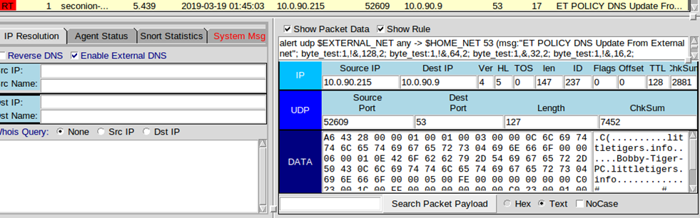
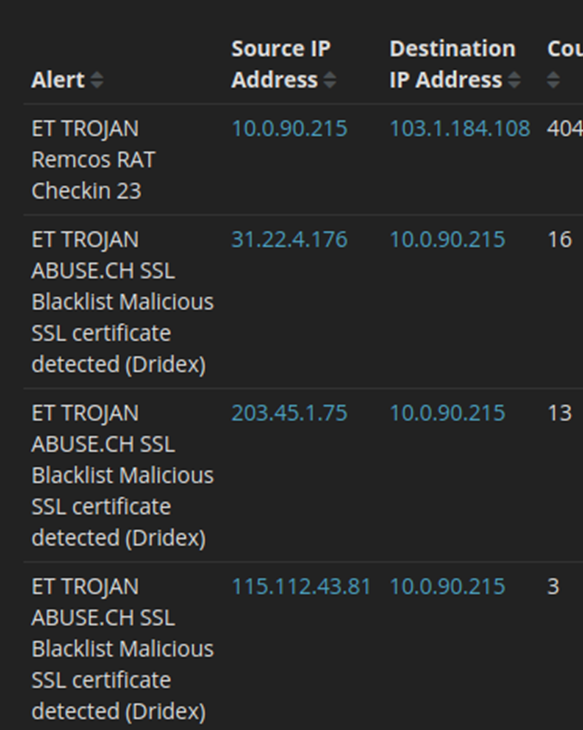
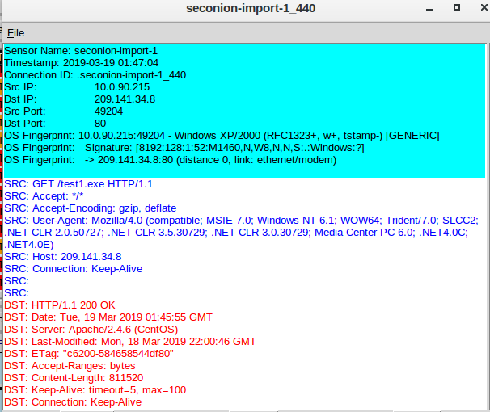
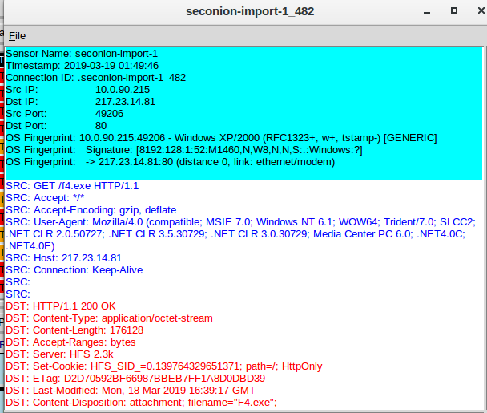
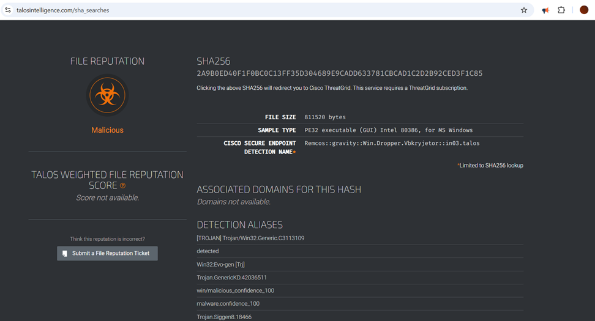
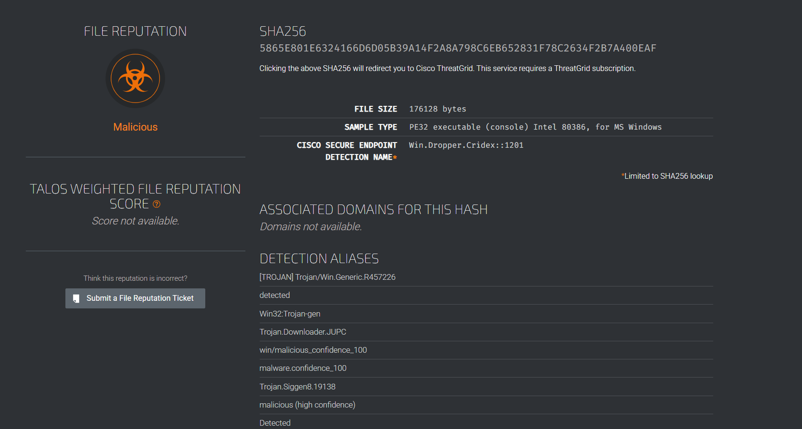
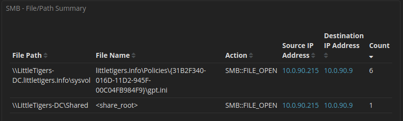

# Remcos RAT Incident Response - Security Onion Analysis

In a simulated enterprise environment, I was assigned as a Tier 1 SOC analyst to investigate suspicious activity flagged by our Security Onion monitoring system. Initial alerts suggested the presence of Remcos RAT — a Remote Access Trojan commonly used in targeted attacks for surveillance, credential theft, and lateral movement.

During the investigation, I used Sguil and Kibana to analyze alert patterns, file transfers, and lateral activity. The infected host (10.0.90.215) downloaded multiple payloads, established command-and-control (C2) communications, and attempted unauthorized access to a domain controller (10.0.90.9) via SMB shares.

Further analysis uncovered indicators of Dridex malware, pointing to a multi-stage attack leveraging remote administration tools and internal network exploitation for persistence and data exfiltration. My findings were documented as part of a complete incident response workflow using open-source tools.

> 📄 [View Full Report (PDF)](main/SECURITY_ONION_INCIDENT_RESPONSE.pdf)

## Project Highlights
- Identified Remcos RAT activity using Security Onion alerts.
- Tracked lateral movement and unauthorized access to domain controller.
- Discovered malicious executables (`test1.exe`, `f4.exe`) linked to Dridex and spyware.
- Documented the attack timeline and proposed remediation actions.

## Tools Used
- Security Onion (Sguil, Kibana)
- Oracle VirtualBox
- Windows 11 Host
- Google Chrome, Microsoft Word

## Key Outcomes
- Mapped a complete multi-stage attack from infection to internal movement.
- Detected both Remcos RAT and Dridex malware in the environment.
- Identified C2 infrastructure and SMB-based privilege escalation.
- Provided actionable mitigation steps to contain and remediate the attack.

---

## Project Steps

### 1. Initial Detection
Monitored Security Onion for new alerts. Detected check-ins from Remcos RAT originating from host `10.0.90.215`.

> **Figure 1:** > Alerts showing Remcos RAT behavior in Sguil and Kibana.

> **Figure 2:** Alerts showing Remcos RAT behavior in Sguil and Kibana.

---

### 2. C2 Communication and File Downloads
Observed HTTP requests to suspicious external IPs serving executables: `test1.exe` and `f4.exe`.

> **Figure 3:** Malicious file download activity and command-and-control check-ins.

> **Figure 4:** Malicious file download activity and command-and-control check-ins.

> **Figure 5:** Malicious file download activity and command-and-control check-ins.

The test1.exe revealed to be a spyware trojan

> **Figure 5:** Malicious file download activity and command-and-control check-ins.

The F4.exe revealed to be a dridex

> **Figure 5:** Malicious file download activity and command-and-control check-ins.

---

### 3. Lateral Movement and SMB Activity
Detected SMB-based access to domain controller `10.0.90.9`. Accessed critical shares and SYSVOL folder containing group policy data.

> **Figure 3:** Unauthorized access to domain controller via SMB protocol.

---

### 4. Attack Flow Timeline
Documented the full infection flow from download to internal propagation:
- `test1.exe`: spyware  
- `f4.exe`: Dridex trojan  
- RAT check-in at 01:47 UTC  
- Lateral movement initiated at 01:50 UTC

---

### 5. Reporting and Recommendations
Compiled all Indicators of Compromise (IoCs), attack flow, and system behaviors. Recommended isolating the infected host, resetting credentials, and scanning for persistence on domain controller and high-risk hosts.

> _"From detection to containment — every alert tells a story."_

---
